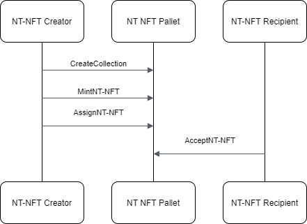
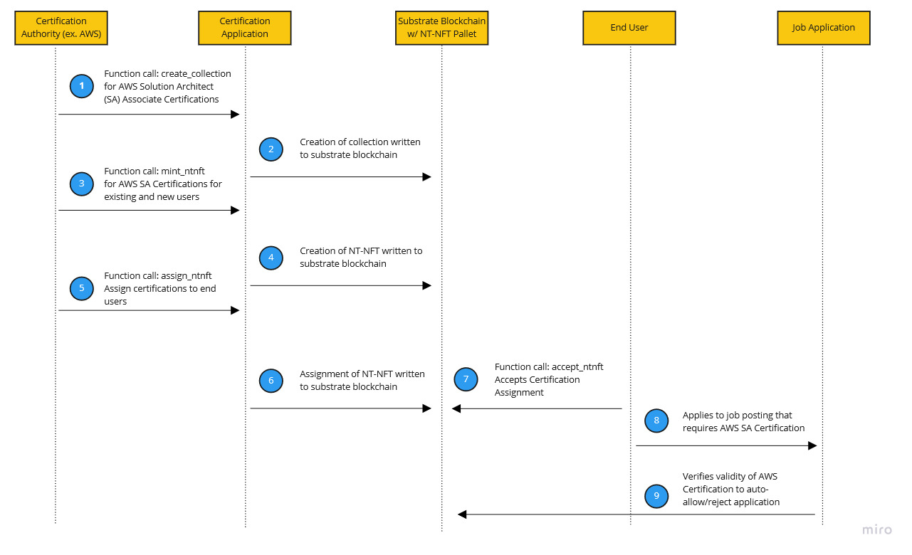
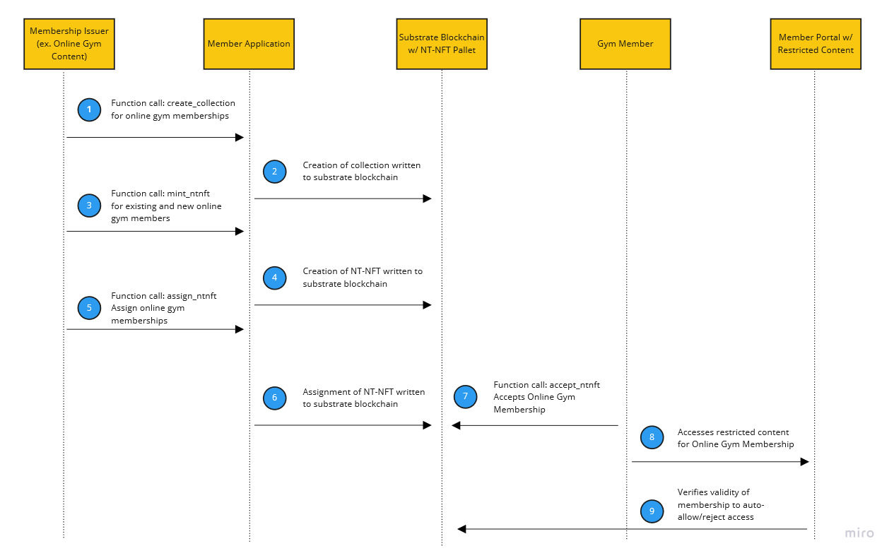

> **Warning**  
> This Pallet is a work in progress, and is currently in an unfinished state.
> For a look at relevant and current work, please reference the repository for [Ventur](https://github.com/Popular-Coding/ventur)

# nt-nft
Substrate pallet that enables parachains to issue non-transferable non-fungible tokens (nt-nfts). 
## Overview

The nt-nft module provides functionality for managing non-transferable non-fungible asset classes, including.

### Problem
NFTs have generated significant value by creating a decentralized distributed digital representation of ownership.  While this has found great success as a solution for assets with transferable ownership like art and even real estate, their transferable implementation is not suitable for non-transferable assets like credentials and memberships which need to be tied to a specific entity.

The need for NT-NFTs has been discussed in the crypto community, most notably, recently Vitalik Buterin wrote about the concept under the moniker of [Soulbound Tokens](https://vitalik.ca/general/2022/01/26/soulbound.html).
### Solution
Our solution is to implement Non-Transferable NFTs within a Substrate pallet.  

At its core, our pallet is based off of Substrate's existing open source [Uniques pallet](https://github.com/paritytech/substrate/tree/master/frame/uniques).  From Uniques' base NFT implementation, we stripped out transferability and have modeled functionality for proposing and accepting NT-NFT assignments.  Proposals and acceptances are intended to prevent unwanted spam NT-NFTs from being assigned to individuals.  
Additionally, we have added an optional expiration value which is aimed specifically at supporting impermanent credentials and memberships.

### Pallet Details
#### NT-NFT Creation and Assignment

#### Certification Scenario

#### Content Restriction Scenario

#### Functions
- create_collection
- destroy_collection
- freeze_collection
- thaw_collection
- mint_ntnft 
- assign_ntnft
- discard_ntnft
- accept_assignment
- cancel_assignment
- force_create
- force_collection_status  

### Next Steps
- Refine NT-NFT Pallets Implementation
- Develop starter implementations for basic certification and membership use cases
- Integrate the NT-NFT pallet into Ventur, a business process focused parachain
- Create a testnet for Ventur and NT-NFT functionality

## Related Modules

* [`System`](https://docs.rs/frame-system/latest/frame_system/)
* [`Support`](https://docs.rs/frame-support/latest/frame_support/)
* [`Assets`](https://docs.rs/pallet-assets/latest/pallet_assets/)
* [`Uniques`](https://github.com/paritytech/substrate/tree/master/frame/uniques)

License: GPLv3
